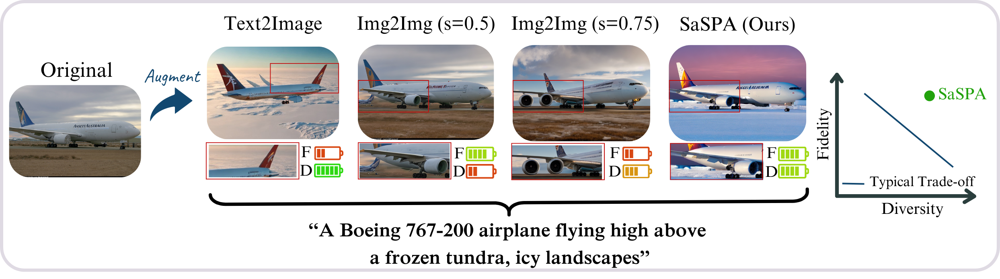

# SaSPA: Advancing Fine-Grained Classification by Structure and Subject Preserving Augmentation




[](https://eyalmichaeli.github.io/SaSPA-Aug/)
[](https://arxiv.org/abs/2406.14551)


## Table of Contents
1. [Setup](#setup)
    - [Environment](#environment)
    - [Datasets](#datasets)
2. [Running the Code](#running-the-code)
    - [Training Baseline Model](#training-baseline-model)
    - [Prompts Construction](#prompts-construction)
    - [Generation and Filtering](#generation-and-filtering)
    - [Training with Augmentations](#training-with-augmentations)
3. [Adding New Datasets](#adding-new-datasets)
4. [Citation](#citation)


## Setup

#### Clone the repo:
```bash
git clone https://github.com/EyalMichaeli/SaSPA-Aug.git
cd SaSPA-Aug
```


### Environment
```bash
conda env create -f environment.yml
conda activate saspa
```
You might need to re-install [PyTorch](https://pytorch.org/get-started/locally/) according to your server.


#### And install locally:
```bash
pip install -e .
```


### Datasets

- **Aircraft, Cars, and DTD**: Downloaded automatically via torchvision to the local folder `data/dataset_name`.
- **CUB**: Download from [Caltech-UCSD Birds-200-2011](https://www.vision.caltech.edu/datasets/cub_200_2011/) to `data/CUB`.
- **CompCars**: Download from [CompCars dataset page](https://mmlab.ie.cuhk.edu.hk/datasets/comp_cars/) to `data/compcars`.


#### Dataset Splits
If the original dataset does not include a validation set, file names splits are provided in `fgvc/datasets_files` and are loaded automatically.


#### Using Weights & Biases (wandb)
In our experiments, we utilize [Weights & Biases (wandb)](https://wandb.ai/site) to streamline and monitor the training process. The training scripts are designed to automatically connect to a wandb account. If you do not have a wandb account or prefer not to use this feature, you can disable wandb logging by setting the `DONT_WANDB` variable in the training script.


## Running the Code

### Training Baseline Model
For our filtering, we need a baseline model trained on the original dataset. We provide with pre-trained checkpoints for each dataset used in our paper in [Google Drive](https://drive.google.com/drive/folders/1Bios3Q4RsXcytsqd0e189C5yF9If06SD?usp=sharing), please download to the folder `all_utils/checkpoints` or any other folder and put the respective path in the dataset class in `all_utils/dataset_utils.py`.

### Prompts Construction
To create the prompts using GPT-4, follow the instructions in the paper.  
The generated prompts should be in `prompts_engineering/gpt_prompts`, which currently contain our generated prompts.  

### Generation and Filtering
The generation code is located at: `run_aug/run_aug.py`.  
Choose a dataset and ensure that `BASE_MODEL = "blip_diffusion"` and `CONTROLNET = "canny"`. If you don't want to use blip_diffusion, you can use other base models such as sd_v1.5. (Currently it's set for sd_v1.5 because it's better for the Aircraft dataset, for all other datasets, set `BASE_MODEL = "sd_v1.5"`)
The code will generate augmentations and then will automatically generate a JSON file with the filtered augmentations.  

### Training with Augmentations
Once you have the JSON file, copy it to `trainings_scripts/consecutive_runs_aug.sh`, under the variable `aug_json`.   
Make sure the correct dataset is specified in the `dataset` variable and fill in the reest of the arguments (GPU ID, run_name, etc.). The appropriate arguments for training, such as augmentation ratio and traditional augmentation used, are automatically chosen in the script based on the dataset name.

That's it!
You should see your training start at `logs/dataset_name/`.  


## Adding New Datasets
To incorporate new datasets into the project, follow these structured steps:
- **Prompt Creation**: Begin by generating and adding new prompts to `prompts_engineering/gpt_prompts`.
- **Dataset Class Development**: Craft a new dataset class within `all_utils/dataset_utils.py` to manage dataset-specific functionalities.
- **Dataset Module Implementation**: Establish a new Python file in the `fgvc/datasets` folder.
- **Dataset Config**: Establish a new Python file with Hyper-parameters in the `fgvc/configs` folder.
- **Baseline Model Training**: Train a baseline model to ensure the new dataset is correctly integrated and functional. This model will also be used in the filtering process.
- **Follow Standard Procedures**: Proceed with the regular augmentation and training workflows as documented in [Running the Code](#running-the-code).


## Citation
If you find our work useful, we welcome citations:
```markdown
@misc{michaeli2024advancing,
      title={Advancing Fine-Grained Classification by Structure and Subject Preserving Augmentation}, 
      author={Eyal Michaeli and Ohad Fried},
      year={2024},
      eprint={2406.14551},
      archivePrefix={arXiv},
      primaryClass={cs.CV}
}
```

## Special Thanks
We extend our gratitude to the following resources for their significant contributions to our project:
- **CAL Repository**: Visit [CAL Repo](https://github.com/raoyongming/CAL) for more details.
- **Diffusers Package**: Learn more about the Diffusers package at [Hugging Face Diffusers Documentation](https://huggingface.co/docs/diffusers/en/index).
